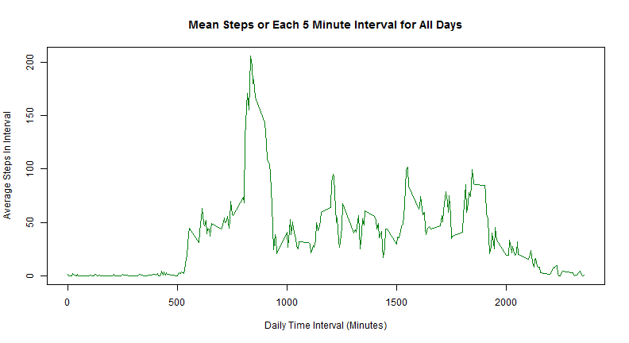
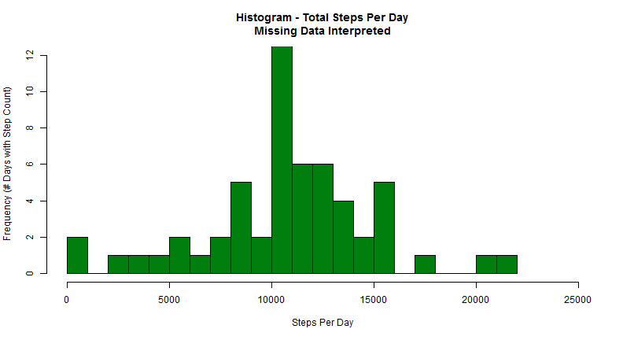
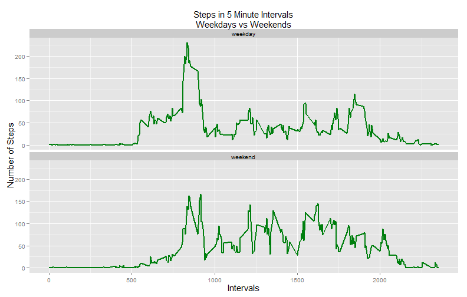

# Reproducible Research: Peer Assessment 1

Report by: lowrylp   
Date: 10/18/2014

This report (Peer Assignment 1) is an analysis of step data collected over a period of time.
The step counts are reported in 5 minute inervals over a given day in the data set.  The data 
set was provided for use.


## Loading and preprocessing the data
Show any code that is needed to:   
1. Load the data   
2. process/transform the data into formats suitable for analysis   


```r
# Setup the environment and load the data
setwd("R:/RepData_PeerAssessment1")
library(timeDate)
library(ggplot2)

#  Color variable for the charts
myColor <- '#007F0E'

# Load the data file
unzip('activity.zip')

# sdata = full dataset
sdata <- read.csv('activity.csv',header=TRUE, sep=',', stringsAsFactors=FALSE)
# rdata = reduced data (missing data removed)
rdata <- na.omit(sdata)
```
    
## What is mean total number of steps taken per day?
For this part of the assignment, ignore the missing values in the origina dataset.
   
#### 1. Make a histogram of the total number of steps taken each day

  

```r
aggrData <- aggregate(rdata$steps, list(rdata$date), FUN=sum)

hist(aggrData$x, col=myColor, main='Histogram - Total Steps Per Day', 
    ylab='Frequency (# Days with Step Count)', xlab='Steps Per Day',
    xlim=c(0,25000), ylim=c(0, 12), breaks=18)
```

 

#### 2. Calculate and report the mean and median total number of step taken per day


```r
meanSteps <- mean(aggrData$x)
medianSteps <- median(aggrData$x)
```
 The mean steps per day: **10766.19**  
 The median steps per day: **10765**  


## What is the average daily activity pattern?

#### 1. Make a time series plot(i.e. type = "l") of the 5-minute interval (x-axis) and the average number of steps taken, averaged across all days (y-axis)


```r
tpSteps <- aggregate(rdata$steps, list(rdata$interval), mean)

plot(tpSteps$Group.1, tpSteps$x, type='l', col=myColor,
     xlab='Daily Time Interval (Minutes)',
     ylab='Average Steps In Interval',
     main='Mean Steps or Each 5 Minute Interval for All Days')
```

 

#### 2. Which 5-minute interval on average acrosss all the days in the dataset, contains the maximum number of steps?

```r
maxVal <- max(tpSteps$x)     
maxInt <- subset(tpSteps, x == maxVal)[,1]
```
The interval with the maximum number of steps is **835**  


## Imputing missing values
Note that there are a number of days/intervals where there are missing
values (coded as `NA`). The presence of missing days may introduce
bias into some calculations or summaries of the data.

#### 1. Calculate and report the total number of missing values in the dataset (i.e. the total number of rows with `NA`s)

```r
# Imputing missing values
numMissing <- nrow(sdata) - nrow(rdata)
```
The number of missing values is: **2304**   


#### 2. Devise a strategy for filling in all of the missing values in the dataset. The strategy does not need to be sophisticated. For example, you could use the mean/median for that day, or the mean for that 5-minute interval, etc.

Loop through the dataset and replace the NA's with the value from the prior data set using the mean total steps for the corresponding time period.

#### 3. Create a new dataset that is equal to the original dataset but with the missing data filled in.

```r
# Copy the original dataset
adjdata <- sdata

# Loop thru it and fill in the NA's
for (r in 1:nrow(adjdata)) {
    if (is.na(adjdata$steps[r])) {
        adjdata$steps[r] <- subset(tpSteps, Group.1 == adjdata$interval[r])[,2]
    }
}
```

4. Make a histogram of the total number of steps taken each day and Calculate and report the **mean** and **median** total number of steps taken per day. Do these values differ from the estimates from the first part of the assignment? What is the impact of imputing missing data on the estimates of the total daily number of steps?

```r
# Aggregate it for the historgram
aggrData2 <- aggregate(adjdata$steps, list(adjdata$date), FUN=sum)

hist(aggrData2$x, col=myColor, main='Histogram - Total Steps Per Day\nMissing Data Interpreted', 
    ylab='Frequency (# Days with Step Count)', xlab='Steps Per Day',
    xlim=c(0,25000), ylim=c(0, 12), breaks=18)
```

 

```r
meanSteps2 <- mean(aggrData2$x)
medianSteps2 <- median(aggrData2$x)

# Calculate some statistics on the adjusted versus original data
deltamean <- meanSteps - meanSteps2
deltamedian <- medianSteps - medianSteps2
pctDifMean <- deltamean / meanSteps
pctDifMedian <- deltamedian / medianSteps
```
 The adjusted mean steps per day: **10766.19**  
 The adjusted median steps per day: **10766.19**  

In comparing these adjusted values to the original values:  
 * Mean steps per day: **10766.19** versus **10766.19** 
 with Delta **0.00** with percent difference **0.00**   
 * Median steps per day: **10765** versus **10766.19** 
 with Delta **-1.189** with percent difference **-0.0001104**   

Filling in the NA's made no significant impact on the analysis.
   
   
## Are there differences in activity patterns between weekdays and weekends?

For this part the `weekdays()` function may be of some help here. Use
the dataset with the filled-in missing values for this part.

1. Create a new factor variable in the dataset with two levels -- "weekday" and "weekend" indicating whether a given date is a weekday or weekend day.

```r
# Add the Day of Week field to the dataset
adjdata$daytype <- ''

# Loop thru it and calculate weekday vs weekend
for (r in 1:nrow(adjdata)) {
    ifelse (isWeekend(as.Date(adjdata$date[r])),
        adjdata$daytype[r] <- 'weekend',
        adjdata$daytype[r] <- 'weekday')
}

# Convert to factor as requested
adjdata$daytype <- as.factor(adjdata$daytype)

# Aggregate it for the following chart
aggrData3 <- aggregate(adjdata$steps, list(adjdata$interval, adjdata$daytype), FUN=mean)
```

2. Make a panel plot containing a time series plot (i.e. `type = "l"`) of the 5-minute interval (x-axis) and the average number of steps taken, averaged across all weekday days or weekend days (y-axis). 


```r
# Fix the field names to make the charting easier
colnames(aggrData3)[1] <- 'Intervals'
colnames(aggrData3)[2] <- 'DayType'
colnames(aggrData3)[3] <- 'Steps'

ggplot(data=aggrData3, aes(x=Intervals, y=Steps)) +
    geom_line(size=1, color=myColor) +
    facet_wrap(~DayType, ncol=1) +
    labs(title='Steps in 5 Minute Intervals\nWeekdays vs Weekends') +
    labs(y='Number of Steps') +
    theme(axis.title.y=element_text(size=15), axis.title.x=element_text(size=15)) +
    theme(plot.title=element_text(size=15))
```

 
